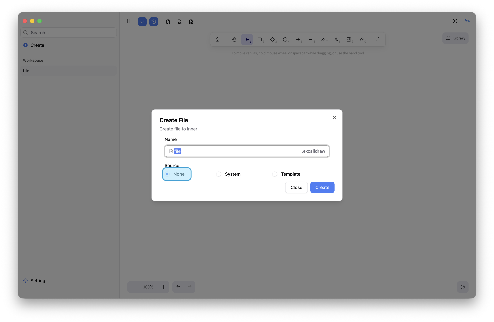
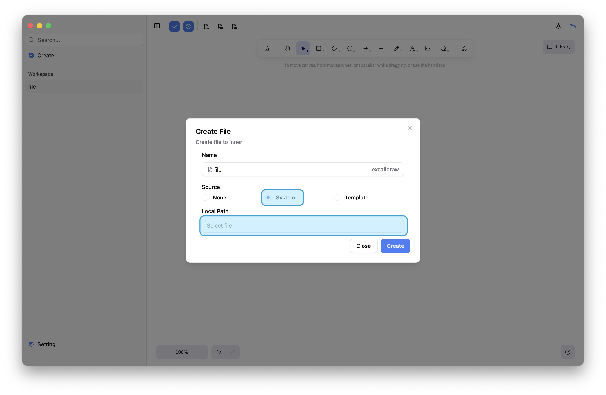
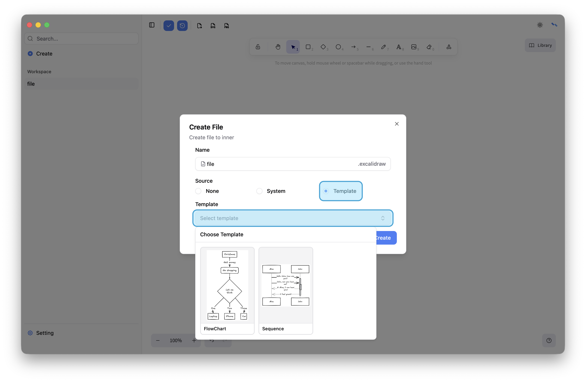

# Create

Supports creating blank boards, creating boards from local files, and using templates. Currently, includes sequence diagrams and flowcharts, with more templates coming soon.

## Empty

## Local File

## Template

