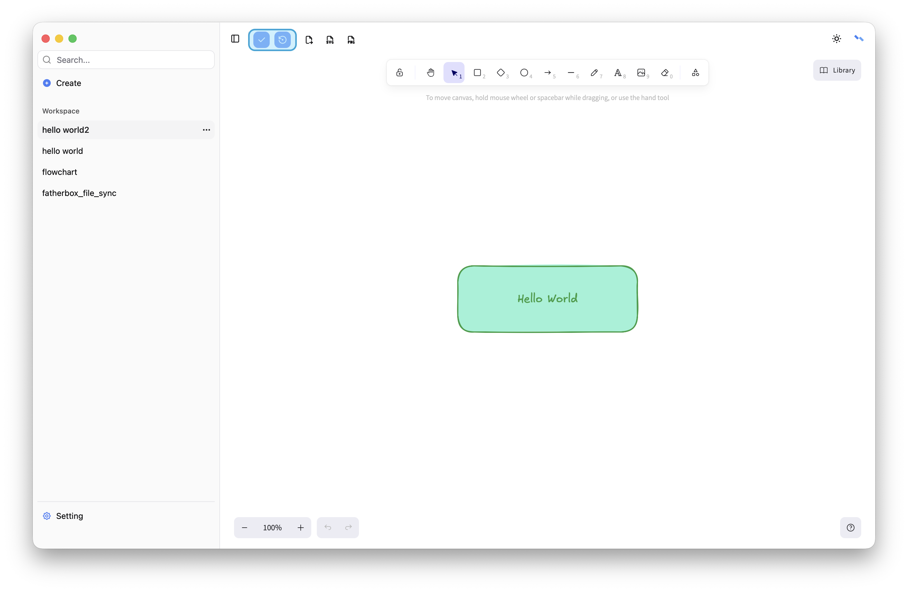

# Edit
Use the top menubar to save or reset your file.

* Save
If there are changes, the file will be saved successfully; otherwise, a message will indicate that no save is needed. Each save creates a `new history record`.
* Reset
Discard changes and restore the file to its original state.

