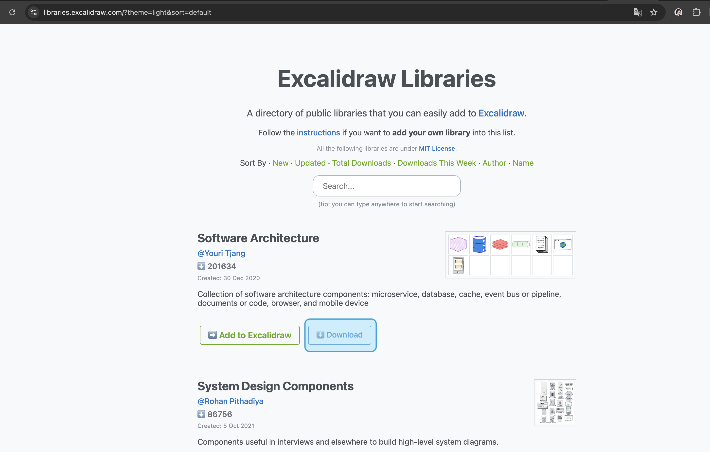
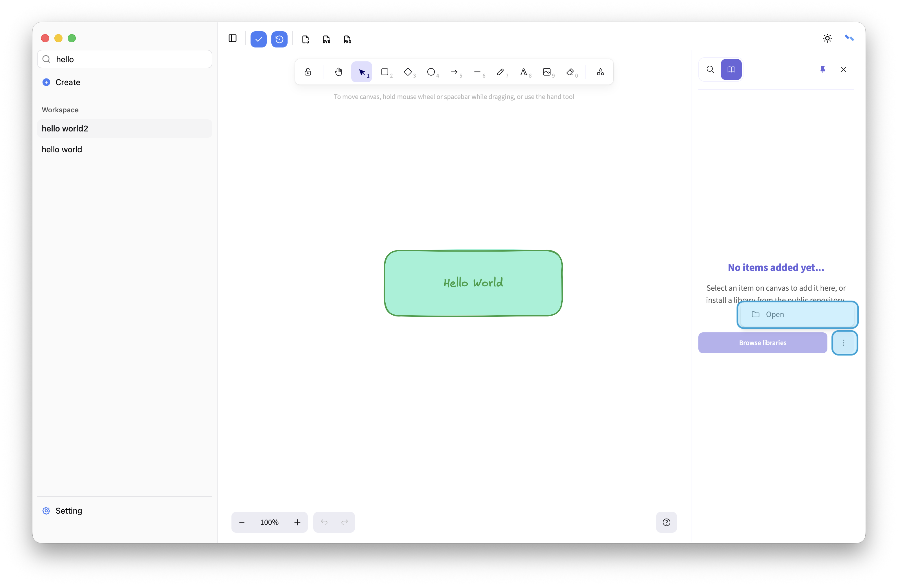
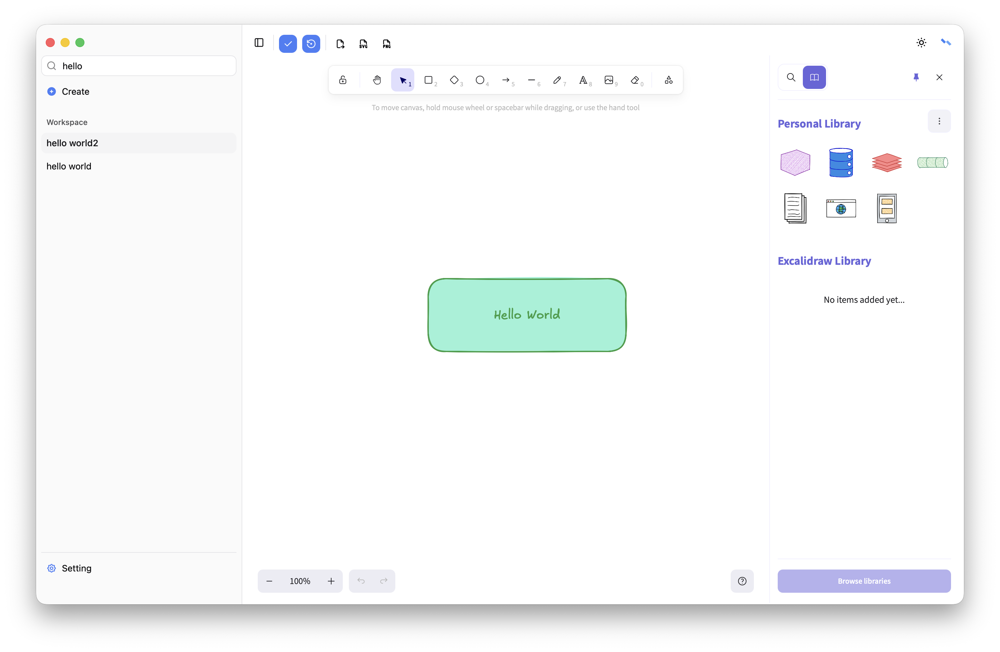
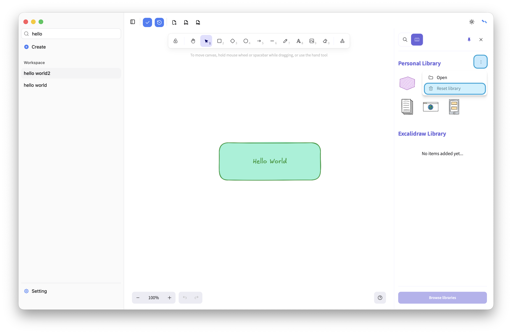

# Library
Compatible with excalidraw library，support import and reset，library shared in all files.

## Import
Download library from [excalidraw library](https://libraries.excalidraw.com/) first.

Open file from local path.

You can use library now.

## Reset

