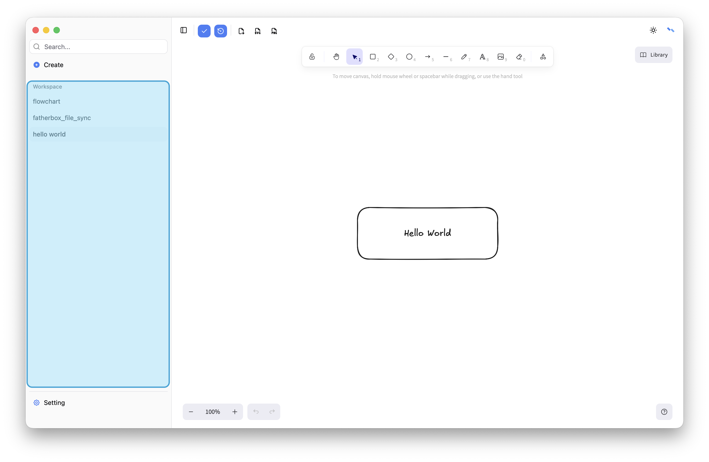
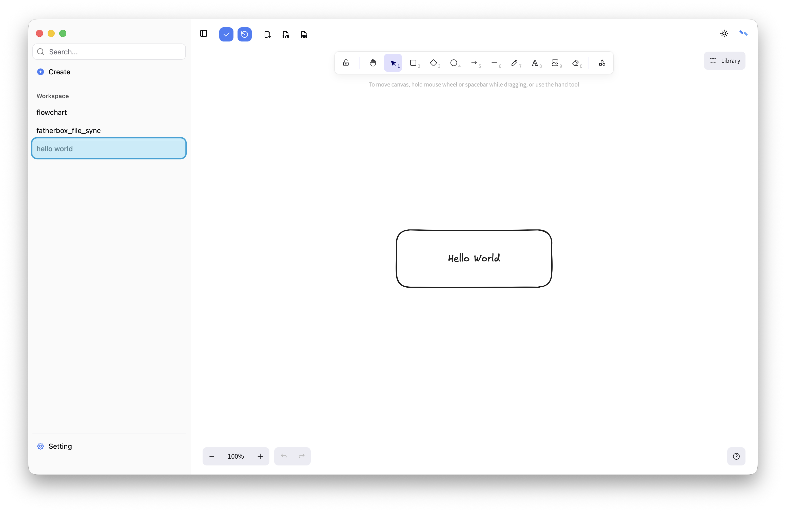
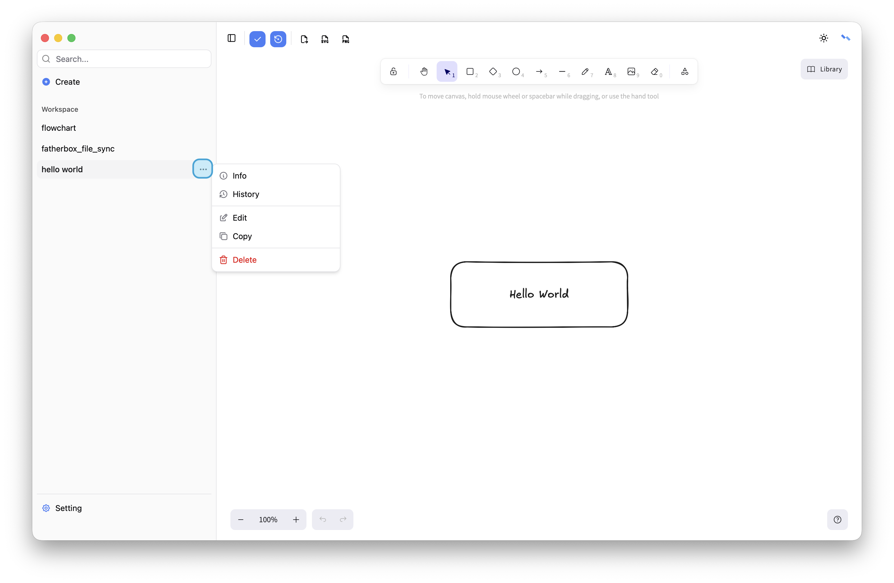
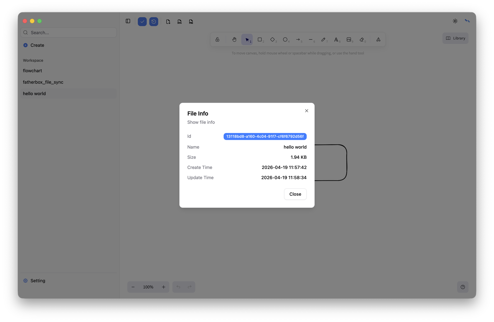
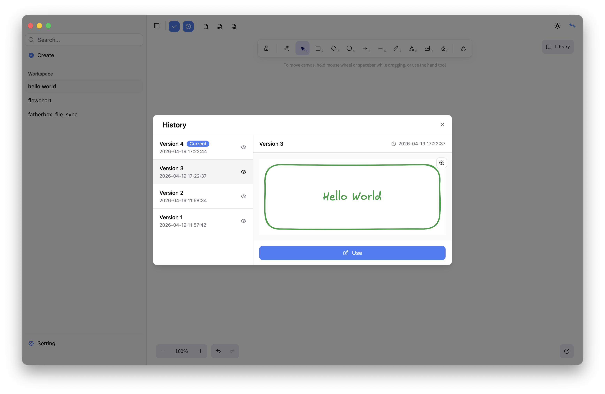
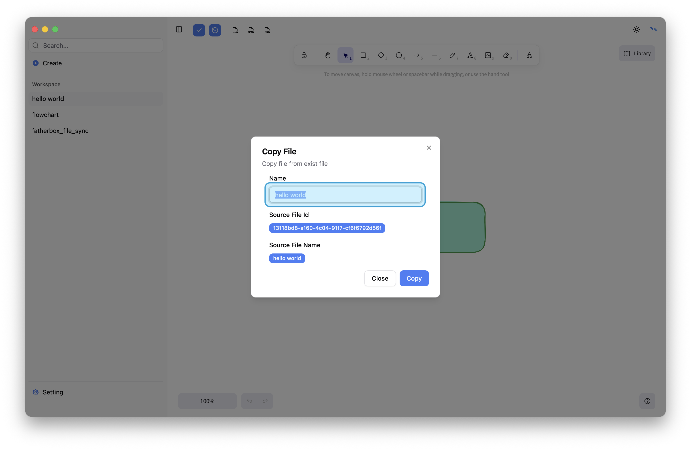
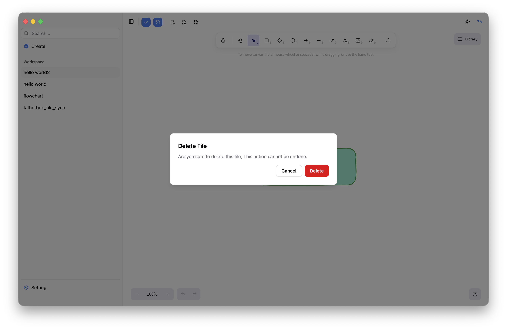

# List
Displays a list of available files with options for selection and actions.

## Select
Click a file to select it; its content will appear in the main area for editing and saving. The last opened file is selected by default.

## Operation
Hover over a file and click the “…” button on the right to access additional actions from the menu.

### Info
Show base info，includes id、 name、size、create time and update time.

### History
Show file versions, you can use old versions.

### Edit 
Edit file name.

### Copy
Copy file from exist file.

### Delete
Delete file. This action cannot be undone.

