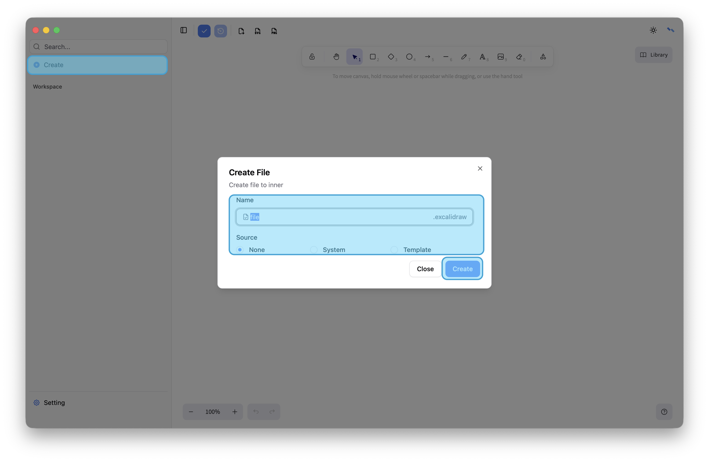
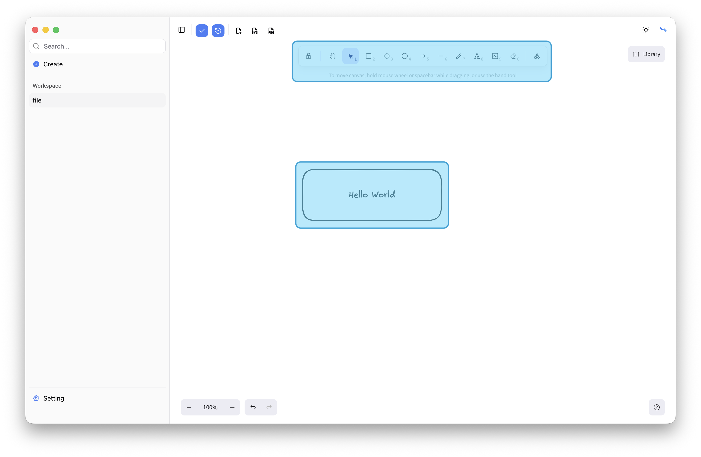
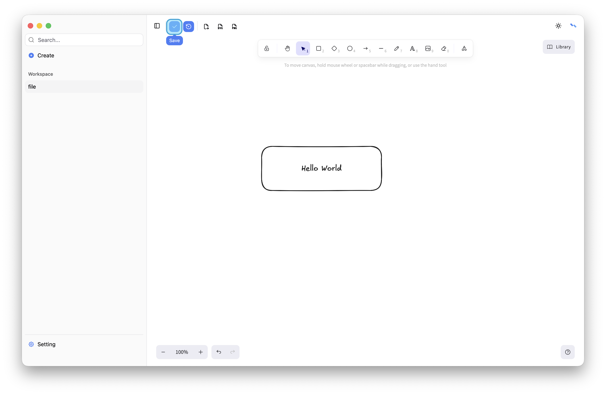

# First Local Whiteboard

Let's discover **Nexthena in less than 1 minute**.

## Getting Started

Download application . It supports Windows、Linux and MacOS.

Current Version 1.1.4

- macos [app](https://apps.apple.com/us/app/nexthena/id6756844674?mt=12)
- windows x64 [exe](https://github.com/blackstar-baba/nexthena-asset/releases/download/v1.1.4/Nexthena_1.1.4_x64-setup.exe)
- Linux x64 [deb](https://github.com/blackstar-baba/nexthena-asset/releases/download/v1.1.4/Nexthena_1.1.4_amd64.deb) [rpm](https://github.com/blackstar-baba/nexthena-asset/releases/download/v1.1.4/Nexthena-1.1.4-1.x86_64.rpm)

### Install and Open

It's simple, just click click click.

### Create

Click left sidebar "Create" button, input you file name and choose source. you can choose local system path or embed
template.

### Edit

Add elements in right main area.

### Save

Click top menubar "Save" button for persistence.

**Congratulations! You have your first local whiteboard now.**
