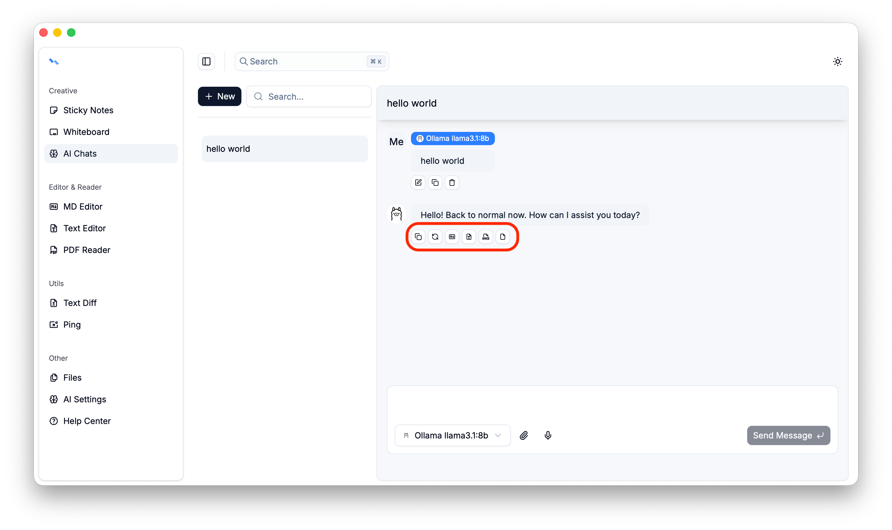
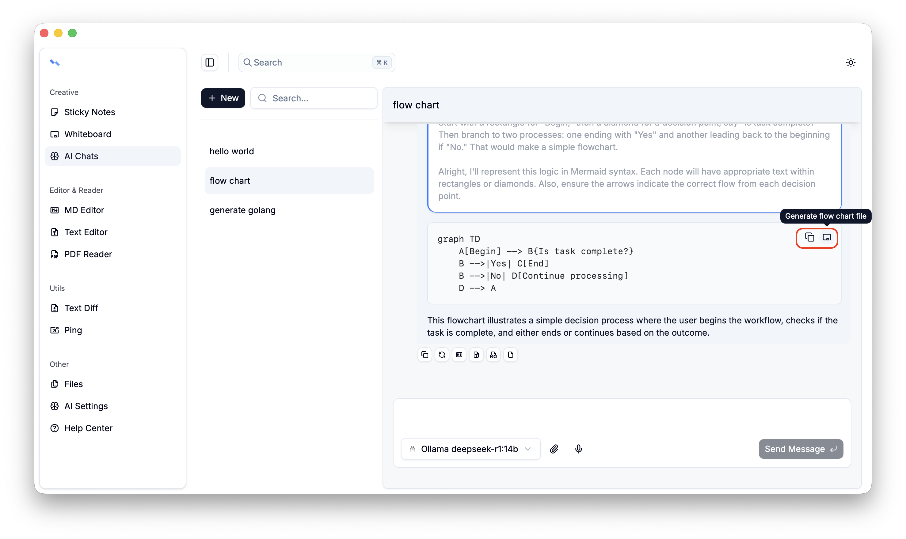

# Ai Chats

Like modern apps, AI is an essential feature. By conversing with AI, we can quickly create a document prototype, and the generated results can even be used directly in production.
Currently, we support creating, deleting, and renaming conversations, as well as editing, copying, deleting, and regenerating conversation messages. Messages can also be converted into flowcharts, Markdown, Word documents, and regular files.

This feature is still evolving, and it’s hard not to marvel at how fast AI is advancing 🤔

**Note**: Before getting started, please configure the providers using [Ai Settings](../ai-settings/index.md).

## Conversation
Supports selecting models and choosing built-in files for the conversation.

**Note**: Once a conversation starts, it cannot be paused.

## Message
Messages are currently divided into two types: user messages and assistant messages

User messages can be edited, copied, and deleted.

Assistant messages can be copied, regenerated, and saved as files.

Code content within a message can be copied or generate  file.

## More

