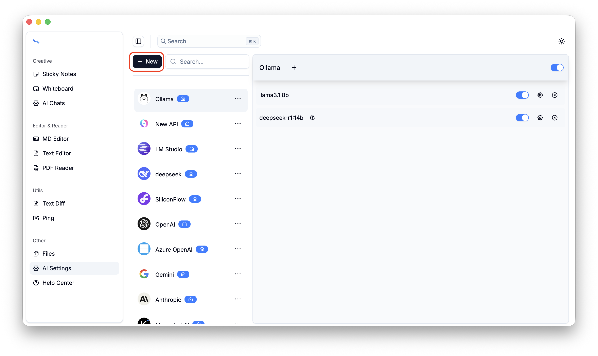
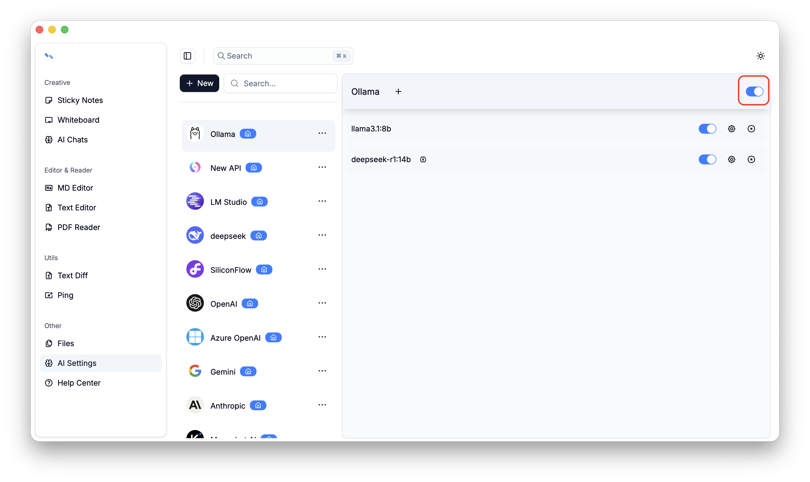
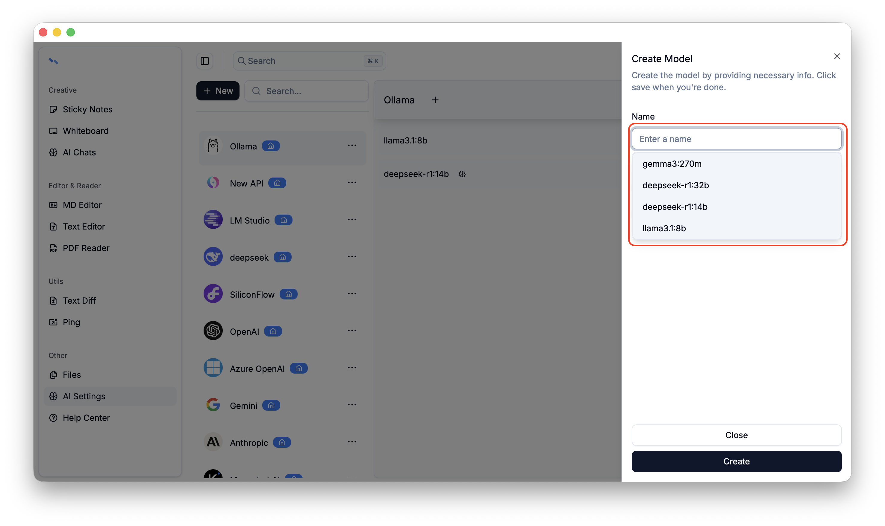
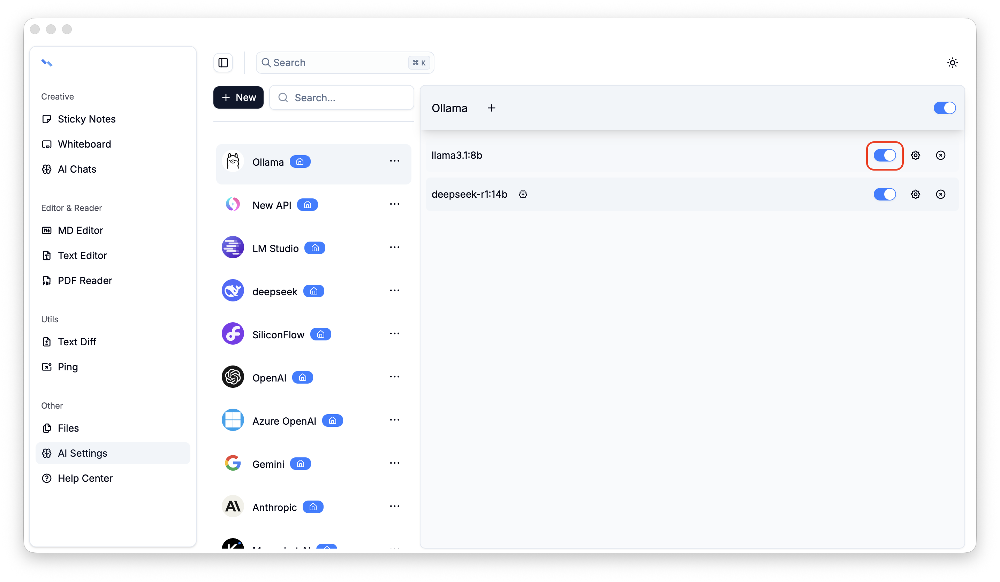

# Ai Settings
Configure the providers and models used for conversations. Only providers and models that are enabled can be used in ai conversations.

# Providers
12 providers are built in, and custom providers can also be added. Built-in providers support editing, while custom providers support both editing and deletion.

If you want to temporarily disable a provider, you can do so using the toggle button.

# Models
Supports adding, updating, and deleting models. When adding a model, the system automatically calls the provider’s models API to retrieve the model list.

If you want to temporarily disable a model, you can do so using the toggle button.

## More

