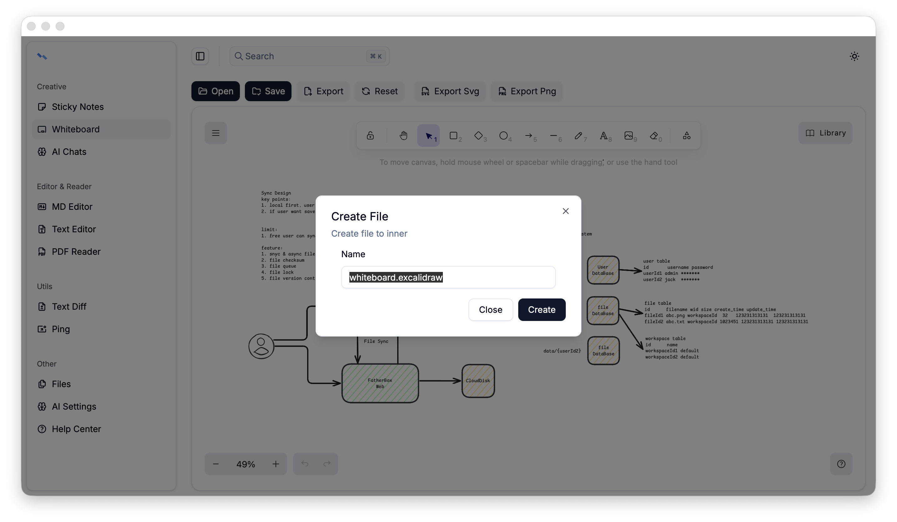
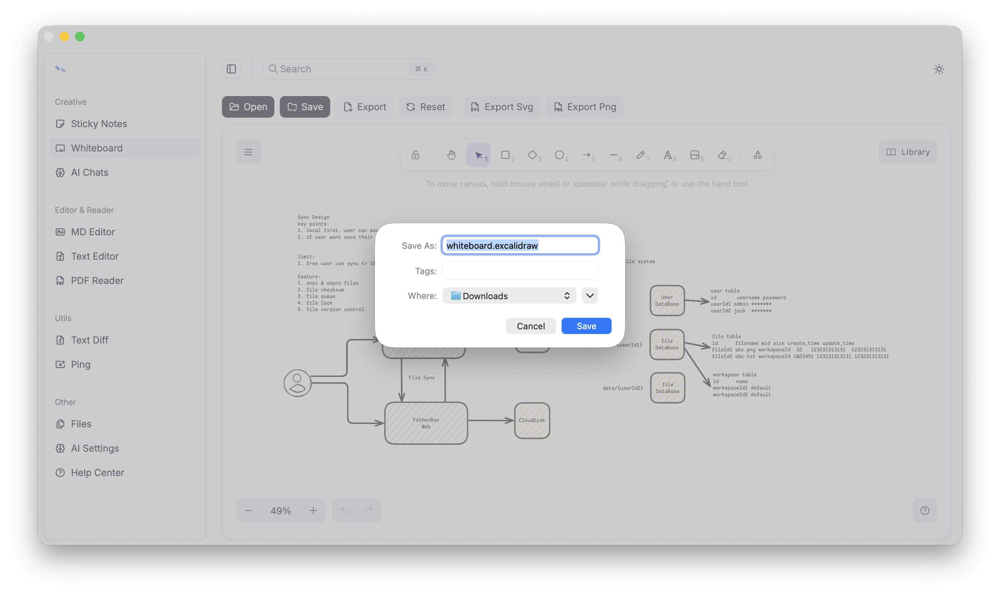
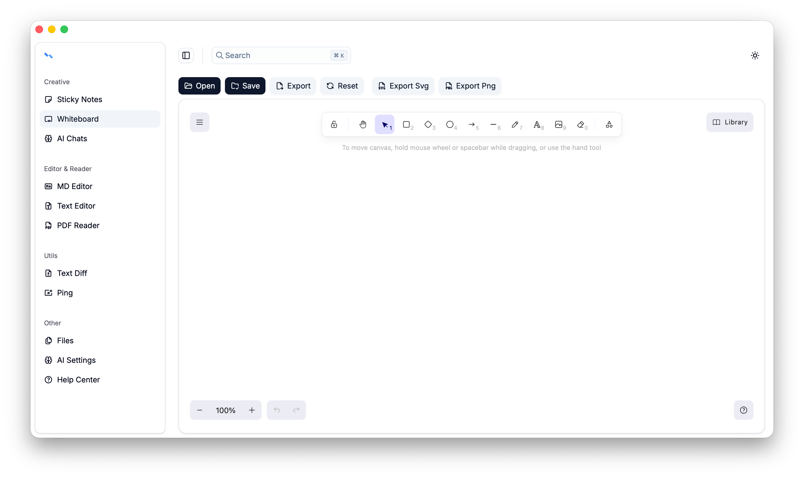

# File Menubar

All features capable of file operations include a file menubar. The main purpose of the file menubar is to operate local files and internal files.

## Open
Supports opening files from the internal file system (Inner) and local system (OS). Confirm in the pop-up window to open the file.

## Save
If the opened file is from the internal file system, it will be saved once. If the opened file is from the local system, a prompt will pop up to confirm whether to save it to the internal file system.

## Export
Export the current content to the local file system.

## Reset
Clear the current file content and reset the open status.

## More
[Inner file system](../file-system/file-system.md)

