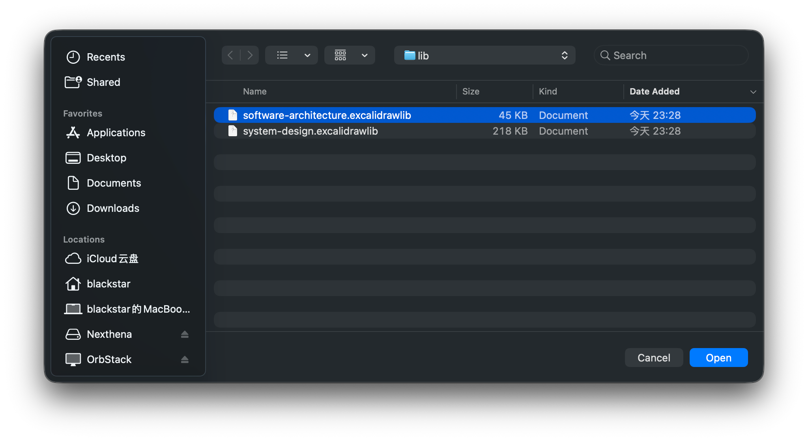

# Whiteboard

It is built on the open-source version of Excalidraw and is compatible with the Excalidraw file format. On the basis of supporting official features, it includes basic file operations.

**Note**: For local application deployment, some remote features have been restricted.

## File Manage
See [File Menubar](../file-menubar/index.md)

## Library
Due to security and technical limitations, it is currently not possible to add items directly from the official library website. However, you can download the resources from the official library at Excalidraw Library and then load them manually.

Click Download to save the file to your local file system.

 

Select the file from your local system to load it.

## More
- Excalidraw Official Documentation [Excalidraw](https://excalidraw.com/)

